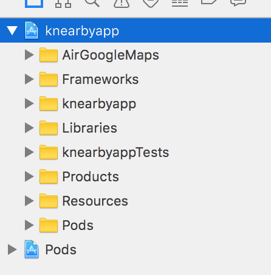
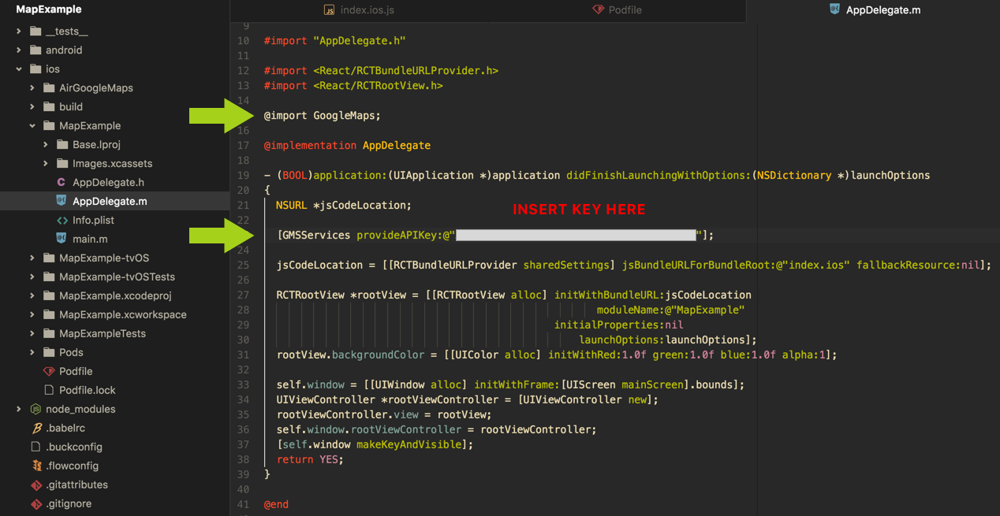
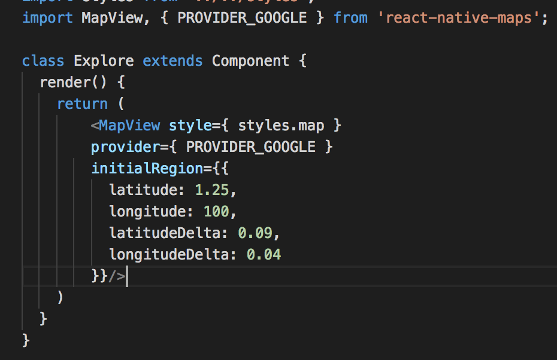
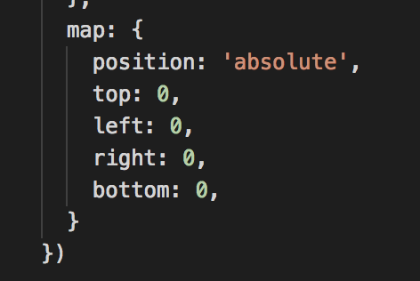

# Setup
Adding Google Map into a react native project. I will be using the library `react-native-maps` from [here](https://github.com/airbnb/react-native-maps) and will be using [Cocoapods](https://cocoapods.org/) in the installation.

1. `yarn add/npm install react-native-maps --save`
2. `react-native link react-native-maps`

## Android

1. In `android/app/build.gradle`, ensure that you have this dependency:
```
dependencies {
   compile project(':react-native-maps')
   ...
}
```
2. In `android/settings.gradle`, ensure that you have this:

```
include ':react-native-maps'
project(':react-native-maps').projectDir = new File(rootProject.projectDir, '../node_modules/react-native-maps/lib/android')
```

3. In `android/app/src/main/AndroidManifest.xml`, insert/modify the following.

```
<meta-data
      android:name="com.google.android.geo.API_KEY"
      android:value="[INSERT GOOGLE MAPS API KEY]"/>
```

## IOS

### Pods
1. Create a `Podfile` for our CocoaPods within the iOS folder in your project with this command `touch ios/Podfile`
2. `gem install cocoapods` (you might need to sudo install)
3. The code that should go into your `Podfile`. Replace `knearbyapp` with the name of your project.

```
source 'https://github.com/CocoaPods/Specs.git'

platform :ios, '8.0'
target 'knearbyapp' do
	rn_path = '../nodules_modules/react-native'

	pod 'yoga', :path => '../node_modules/react-native/ReactCommon/yoga/yoga.podspec'

  pod 'React', path: '../node_modules/react-native', subspecs: [
    'Core',
    'RCTActionSheet',
    'RCTAnimation',
    'RCTGeolocation',
    'RCTImage',
    'RCTLinkingIOS',
    'RCTNetwork',
    'RCTSettings',
    'RCTText',
    'RCTVibration',
    'RCTWebSocket',
    'BatchedBridge'
	]
	
	pod 'GoogleMaps'
	
	post_install do |installer|
		installer.pods_project.targets.each do |target|
			if target.name == "react-native-google-maps"
				target.build_configurations.each do |config|
					config.build_settings['CLANG_ENABLE_MODULES'] = 'No'
				end
			end
			if target.name == "React"
				target.remove_from_project
			end			
		end
	end

end
```
4. `cd ios` and `run pod install` on the IOS folder
5. Now, you will no longer be using `.xcodeproj` file, and will now be using your workspace `.xcworkspace`

### Configure XCode
6. Within your Finder go into your node_modules in your project and navigate to the AirGoogleMaps folder (node_modules/react-native-maps/lib/ios/AirGoogleMaps)
7. Open your .xcworkspace file in Xcode
8. Drag the AirGoogleMaps folder into your project in Xcode.


9. There will be a pop-up in which you will specify to Create groups. Tick `Copy files if needed`, `Create groups`, and add your main project target.
10. Ensure that your `Build Phases`in the target has `libAirMaps.a` and `libPods-XXX.a`
11. Go to `Build Settings` > `Search Paths`, double click on the file path in the `Header Search Paths`
12. A pop-up will appear and click on the plus sign to add this line of code and change  `non-recursive` to `recursive`:
```
$(SRCROOT)/../node_modules/react-native-maps/ios/AirMaps
```
13. To use Google maps, create a Google Maps API key.

### Modify AppDelegate.m
14. Insert these 2 lines of code in the `AppDelegate.m` file in the project.

```
@import GoogleMaps;
```

```
[GMSServices provideAPIKey:@"YOUR_GOOGLE_MAP_API_KEY"];
```



*source: https://codeburst.io/react-native-google-map-with-react-native-maps-572e3d3eee14*

### Add a MapView in the app

15. Add the following `MapView` component into the view which you want to show the map in.



16. Remember to set the style as follow before the map can appear.




